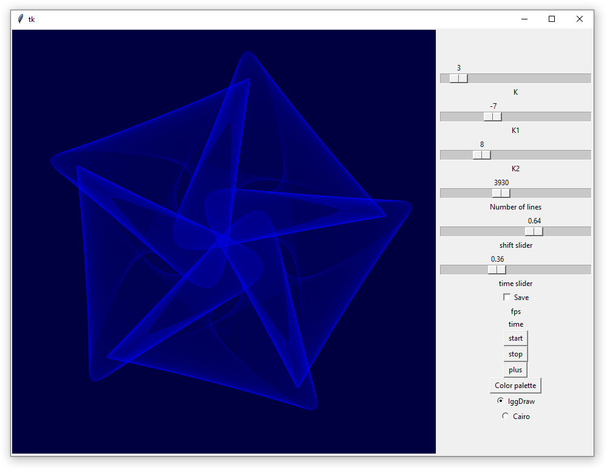

# SpirographPy

Art Trigonometry. ))

This experiment with beautiful curves is inspired by the Spirograph children's toy, [@generomics](https://www.instagram.com/generomics/) on Instagram and lecture Frank Farris,  [Mathematical Art and Spaces of Functions](https://www.youtube.com/watch?v=-eyqMtm-8ps)

The curve is the sum of three waves with different frequencies. And it is filled with segments connecting points with different phases.

In App you can play with the frequencies of the waves, and get nice pictures.

